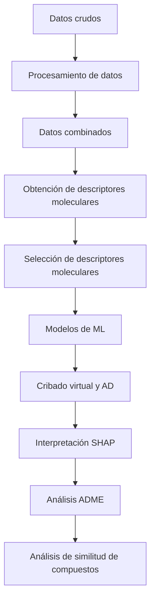

# **Modelos QSAR para la identificación de moléculas activas contra el virus del dengue**

## **Descripción y objectivo**
Este repositorio contiene los datos crudos y procesados, el código y los resultados de un estudio QSAR (*Quantitative Structure-Activity Relationship*) orientado al desarrollo de modelos predictivos para la identificación de moléculas con potencial actividad antiviral frente al virus del dengue. 

El objetivo principal del proyecto es utilizar los valores de actividad y descriptores moleculares de compuestos previamente evaluados experimentalmente para desarrollar modelos de Machine Learning (ML) capaces de predecir la actividad antiviral de nuevas moléculas y facilitar su posterior aplicación en procesos de cribado virtual.

## **Flujo de trabajo**
El flujo de trabajo incluye la recopilación y procesamiento de los datos, generación y selección de descriptores moleculares, entrenamiento y evaluación de modelos de ML, interpretación de las predicciones mediante SHAP, evaluación del dominio de aplicabilidad (AD) y cribado virtual de nuevas moléculas con posterior análisis de propiedades ADME de las moléculas seleccionadas.

Concretamente, el proyecto sigue el siguiente flujo de trabajo:

## **Estructura del repositorio**

### **01_datos_crudos/**
Contiene los datos originales utilizados como punto de partida del estudio. Más en detalle, contiene los datos obtenidos de 5 bases de datos distintas: PubChem, BindingDB, ChEMBL, DenvInD y DrugRepV.

Los datos de esta carpeta corresponden a las fuentes originales y se mantienen separados de los datos procesados para preservar la trazabilidad del análisis.

### **02_procesamiento_datos/**
Contiene los scripts y resultados relacionados con el procesamiento y limpieza de los datos. Entre las tareas realizadas se incluyen, dependiendo del conjunto de datos:

- Fitración de registros por "dengue virus".
- Fitración de registros por valores de actividad (IC50 o EC50).
- Estandarización de unidades.
- Selección de columnas (estructura SMILES y actividad).
- Normalización de estructuras químicas (SMILES canónicos).
- Eliminación de duplicados.
- Tratamiento de valores ausentes.
- Transformación de variables (valor de actividad en 0 y 1 para inactiva y activa, respectivamente).

### **03_datos_combinados/**
Contiene la combinación de todos los conjuntos de datos procesados. Una vez combinados, se elimina los duplicados para la obtención de los datos finales que constituyen la base utilizada posteriormente para la obtención de descriptores y desarrollo de los modelos. 

### **04_descriptores_moleculares/**
En esta etapa se calculan los descriptores moleculares (Mordred descriptors) utilizados para representar las características estructurales y fisicoquímicas de los compuestos. Los descriptores se utilizan como variables de entrada (features) para los modelos de ML.

### **05_seleccion_descriptores_moleculares/**
Contiene los procedimientos utilizados para reducir y seleccionar el conjunto de descriptores moleculares. Concretamente, se utilizó la correlación de Pearson y Spearman y, posteriormente, se seleccionó aquella que presentaba mejores resultados. 

El objetivo de esta etapa es identificar las variables más informativas, reducir la dimensionalidad y evitar problemas derivados de variables redundantes o altamente correlacionadas.

### **06_modelos_ML/**
Contiene el desarrollo y evaluación de los modelos de ML. Los modelos utilizados en este trabajo han sido: Random Forest, Support Vector Machines, k-NN, Naive Bayes, Logistic Regression, AdaBoost, Gradient Boosting, ExtraTrees, Multilayer Perceptron y XGBoost. 

Las tareas realizadas son:
- División de los datos en conjuntos de entrenamiento y prueba.
- Entrenamiento de los modelos.
- Optimización de hiperparámetros.
- Validación cruzada.
- Evaluación del rendimiento y comparación entre modelos. Las métricas de evaluación fueron: exactitud, especificidad, sensibilidad, ROC-AUC, puntuación F1 y MCC.
- Selección del modelo final.
  
### **07_AD_y_Cribado/**
Esta carpeta contiene análisis posteriores al desarrollo del modelo final. Concretamente, se realizó un cribado virtual de nuevas moléculas y el cálculo del AD. Se seleccionaron como compuestos candidatos solo aquellos que presentaban un valor de probabilidad de activos mayor a 0,8 y que se encontraban dentro del AD. 

### **08_SHAP/**
Se utiliza SHAP (SHapley Additive exPlanations) para interpretar las predicciones del modelo e identificar la contribución de los diferentes descriptores moleculares. Esto permite pasar de una predicción puramente numérica a una interpretación de qué características moleculares están asociadas con las predicciones del modelo.

### **09_ADME/**
Se realiza un análisis de propiedades ADME (Absorption, Distribution, Metabolism and Excretion) de los compuestos seleccionados como candidatos con el objetivo de complementar la predicción de actividad con una evaluación preliminar de sus propiedades farmacocinéticas.

### **10_similitud_compuestos/**
Finalmente, se llevó a cabo un análisis de enriquecimiento de huellas moleculares de los compuestos candidatos utilizando como referencia las moléculas empleadas en el entrenamiento de los modelos. Este análisis permitió identificar las subestructuras moleculares presentes en los candidatos que se encontraban enriquecidas en las moléculas clasificadas como activas en comparación con las inactivas. 

## **Resultados**
Los principales resultados obtenidos en el estudio incluyen:
- La utilización final de 6279 entradas para la creación de los modelos de ML. Dichas entradas contienen la estructura SMILES del compuesto y el valor de actividad contra el virus del dengue.
- Desarrollo de diez modelos de ML para la predicción de actividad frente al virus del dengue.
- Selección del modelo SVM con kernel radial como el mejor modelo obtenido. Métricas de evaluación: exactitud = 0,811, valor F1 = 0,807, especificidad = 0,803, sensibilidad = 0,820 ROC-AUC = 0,884 y MCC = 0,623.
- Identificación de los descriptores moleculares con mayor relevancia predictiva gracias al análisis SHAP.
- Evaluación de la confiabilidad de las predicciones mediante AD.
- Priorización de compuestos potencialmente interesantes para estudios posteriores. Concretamente, se obtuvieron 7 potenciales candidatos: Islatravir, Zabicipril, Sabizabulin, Trimethoprim, Ramipril, Combretastatin A-1 y Emvododstat.
- Evaluación preliminar de propiedades ADME de los compuestos priorizados con resultados favorables para la mayoría de ellos. 
- Huellas moleculares más presentes en moléculas activas en comparación con las inactivas.

## **Reproducibilidad**
Para reproducir el análisis, se recomienda crear un entorno virtual e instalar las dependencias indicadas en requirements.txt.
